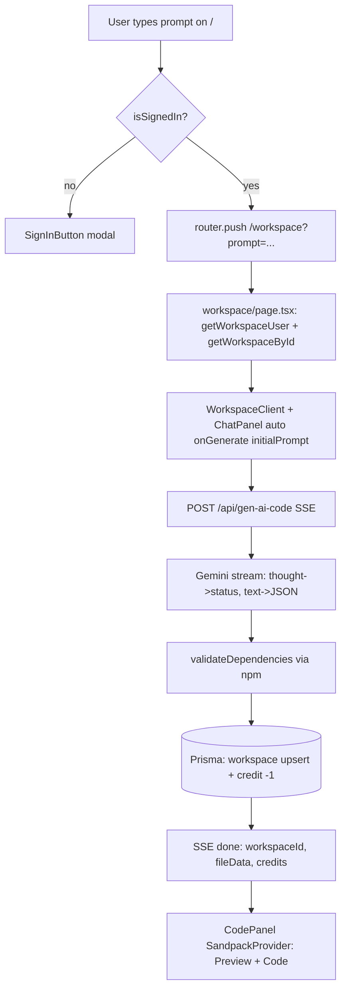
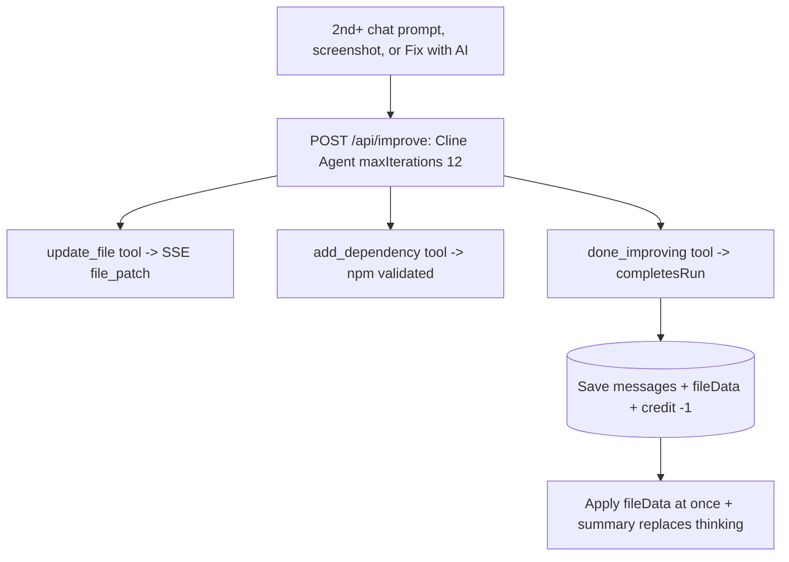

# 05 — Workflows (how it works end-to-end)

## Flow A — First generation (prompt -> preview + code)

How preview works: `CodePanel` builds `files = fileData.files ?? PLACEHOLDER_FILES`, `dependencies = BASE + AI`, `key = sorted paths`. `SandpackProvider template=react` compiles in browser. Content updates go via `sandpack.updateFile(path,code)` diff — no remount unless path set changes. Tailwind via CDN external resource, recompile delayed 500ms.

How code view works: same provider, `SandpackFileExplorer` + `SandpackCodeEditor readOnly` tabs. `keepMounted` both tabs.

## Flow B — Iterate via chat (first prompt only, no files yet)

Same as A: `buildContents` includes history (trimmed `first+last8`). No `fileData` exists yet, so AI returns **all** files. Workspace `create` stores messages + fileData. After this, follow-ups use Flow C.

## Flow C — Follow-up chat via Agent (all plans, hybrid)

Routing lives in `WorkspaceClient`: no workspace/files yet -> Flow A/B (one-shot JSON); otherwise -> this flow. No separate Improve button. Patches apply at `done` to avoid Sandpack remounts mid-stream. If the step budget runs out after files changed, completed updates are kept (partial `done`, 1 credit, "ask to continue"); if nothing changed, a free friendly error is sent.

## Flow D — Preview error -> Fix with AI

`SandpackInner listen(show-error|compile)` -> `previewError` banner (preview tab only) -> `Fix with AI` -> `handleFixError(error)` -> agent patch path (Flow C) when files exist, else generation.

## Flow E — Projects / persistence

`/projects` -> `getUserProjects` -> cards with `firstPrompt`, `messageCount`, `updatedAt` time-ago. Click -> `/workspace?id=` -> `getWorkspaceById` loads messages + fileData into `WorkspaceClient` initial state. Delete -> `deleteProject` + revalidate.

## Flow F — Auth / billing / credits

`proxy.ts` redirects anon from `/workspace|/projects` to sign-in. `Header checkUser()` creates (10 free credits) or syncs plan delta on upgrade. `PricingModal`/`page.tsx` pricing -> `CheckoutButton planId` -> Clerk checkout drawer -> Stripe. Both AI routes 402 gate no-credits (1 credit each, all plans). Credits only decremented inside success transaction.

## Flow G — Export ZIP

`handleExportZip`: reads `sandpack.files` (fallback `fileData.files`), merges `BASE + AI` deps into `package.json (react 18, react-scripts 5)`, writes `public/index.html`, `src/<path>` files, `src/index.js` StrictMode mount, `README.md`, downloads `<appTitle>.zip`.

## SSE event contract

- `status {message}` — thinking label / Validating / Saving.
- `thinking {text}` (improve only) — agent reasoning deltas.
- `file_patch {path, code, reason}` (improve only).
- `done {workspaceId?, fileData, creditsRemaining, assistantMessage?|summary?}`.
- `error {message, code?: QUOTA_EXCEEDED, retryAfter?: number}` — never deducts credits.
