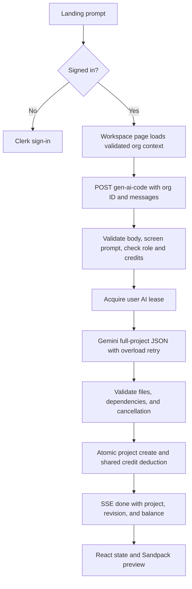
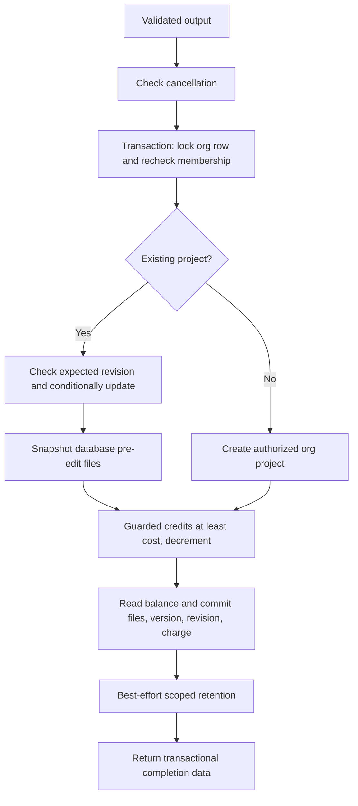
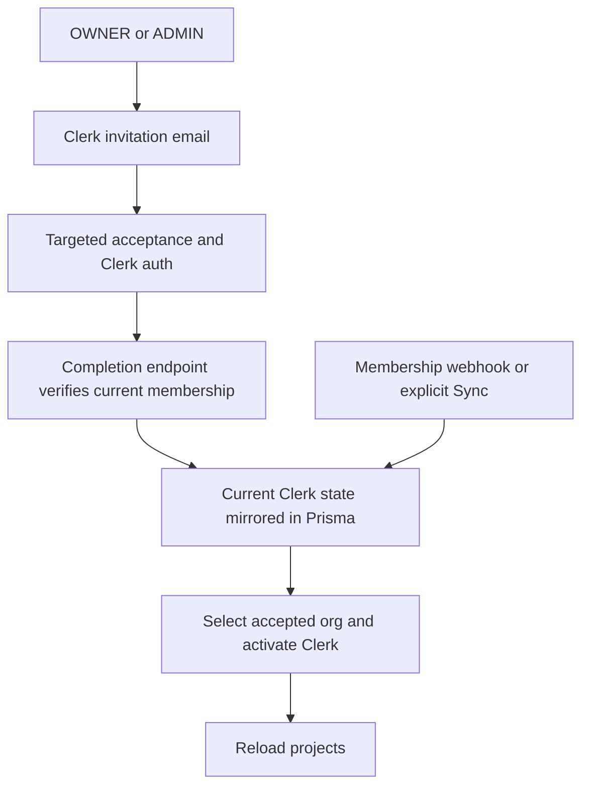

# 05 — End-to-End Workflows

Last reviewed: **2026-10-01**. The server/database is authoritative for access,
revisions, and credits; browser progress is not a save receipt.

## A. First generation

```mermaid
flowchart TD
  Prompt[Landing prompt] --> Auth{Signed in?}
  Auth -- No --> SignIn[Clerk sign-in]
  Auth -- Yes --> Page[Workspace page loads validated org context]
  Page --> Request[POST gen-ai-code with org ID and messages]
  Request --> Guards[Validate body, screen prompt, check role and credits]
  Guards --> Lease[Acquire user AI lease]
  Lease --> Model[Gemini full-project JSON with overload retry]
  Model --> Validate[Validate files, dependencies, and cancellation]
  Validate --> Save[Atomic project create and shared credit deduction]
  Save --> Done[SSE done with project, revision, and balance]
  Done --> Preview[React state and Sandpack preview]
```

New projects require OWNER/ADMIN and matching current app organization.
Identity is derived from Clerk, not a body `userId`. Initial generation is
Gemini regardless of the editing-model toggle. Invalid output/provider failure
before save does not charge. Organization changes invalidate a stale create
request instead of silently creating in another organization.

## B. Follow-up edit / Fix with AI / regenerate

`WorkspaceClient` routes prompts with an existing project/file set to
`/api/improve`. Regenerate and edited-message resubmission reuse the same routing
and current model choice; preview errors use **Fix with AI**.

1. Send project ID, expected revision, request/history, files, and allowlisted
   editing model (Gemini/Qwen/Atria).
2. Server validates, screens/rate-limits, verifies project-org membership,
   checks credits/revision, and claims user **and project** AI leases.
3. Agent mutates per-run file/dependency maps using tools; progress arrives as
   `thinking` / `file_patch`. Overload retries reset maps for each attempt.
4. No changes → free `done`, no snapshot/commit, freshly read balance.
5. Valid changed work → validate packages/cancellation and shared save helper.
   A step-limited partial edit can be retained for one credit with `partial: true`.
6. Completed file data, revision, and balance update client state; refresh
   history. Release leases in finalization.

Quota/overload errors are classified by actual provider errors, not generically
as exhausted steps. Some explicitly classified partial runs may retain valid
changes; no changes, cancellation before commit, invalid files, or failed save
do not charge. See [08](./08-ai-agent-deep-dive.md) for exact branches.

## C. Shared AI commit

```mermaid
flowchart TD
  Output[Validated output] --> Abort[Check cancellation]
  Abort --> Lock[Transaction: lock org row and recheck membership]
  Lock --> Existing{Existing project?}
  Existing -- Yes --> CAS[Check expected revision and conditionally update]
  CAS --> Snapshot[Snapshot database pre-edit files]
  Existing -- No --> Create[Create authorized org project]
  Snapshot --> Charge[Guarded credits at least cost, decrement]
  Create --> Charge
  Charge --> Commit[Read balance and commit files, version, revision, charge]
  Commit --> Cleanup[Best-effort scoped retention]
  Cleanup --> Result[Return transactional completion data]
```

Any transaction failure rolls back all of its database changes. The snapshot is
the database's previous state, never a stale browser payload. Expected-revision
checks prevent last-writer-wins code loss. Cleanup failure after commit is
logged without falsely reporting a failed/uncharged generation.

## D. Cancellation and uncertain completion

Stop, navigation, stream cancellation, or the execution timeout propagates to
the provider/persistence signal. Cancellation is checked after package lookups
and before transaction completion. UI unmount aborts live controllers.

**Boundary:** aborting after the database commits does not undo that commit,
and the provider may still charge for already-started work. If the response
ends without confirmed `done`, the client refreshes server truth rather than
treating a local optimistic refund as proof of an uncharged run. Review the
saved project/balance before retrying.

## E. Open/list/delete projects and restore history

- `/projects`: list active organization's workspaces.
- `/workspace?id=...`: authorize membership, load files/revision and the
  **project's** org role/credits; user's own last push target is returned.
- Project deletion: strict project ID plus OWNER/ADMIN org membership, then
  scoped deletion/cascading history/targets.
- Restore: submit project/version/current revision; authorize, compare revision,
  reconstruct/check hashes under locks, record DB files as `Before restore`,
  replace full files/increment revision atomically. Free and undoable while the
  pre-restore version remains retained.
- Retention: internal `lib/versions.ts`, newest 20 with exact-project filters;
  promote retained boundary deltas to checkpoints before deleting their bases.
  Pruning is not a public server action. See [11](./11-text-patch-version-history.md)
  for the patch/checkpoint format and deployment requirements.

## F. Organization creation and switching

First personal organization provisioning locks the user row, rechecks for an
existing membership, claims the one-time trial marker, creates local OWNER,
then creates the Clerk organization with `createdBy` and exact private metadata.
An additional explicitly created organization starts with zero credits.

Switching validates target membership on the server, persists selection, then
activates matching Clerk context. Failed activation can trigger one OWNER-only
legacy setup repair; visible failure rolls back selection. Selection repair
writes conditionally so a delayed page request cannot overwrite a newer switch.
Empty organizations are valid; no project-count heuristic chooses billing context.

## G. Invitation and membership lifecycle

```mermaid
flowchart TD
  Manager[OWNER or ADMIN] --> Invite[Clerk invitation email]
  Invite --> Accept[Targeted acceptance and Clerk auth]
  Accept --> Complete[Completion endpoint verifies current membership]
  Complete --> Mirror[Current Clerk state mirrored in Prisma]
  Mirror --> Select[Select accepted org and activate Clerk]
  Select --> Projects[Reload projects]
  Event[Membership webhook or explicit Sync] --> Mirror
```

Role changes/removal go through Clerk first under the org lock, then update
Prisma. Webhooks use **current provider state**, not delayed creation roles.
Full sync includes missing-member removal; background sync does not overwrite
another valid active selection. App role endpoints cannot change OWNER; sole
OWNER cannot leave/be removed. External Clerk changes remain authoritative.

## H. Subscription and allowance lifecycle

1. UI opens Clerk organization checkout only after OWNER/context preflight.
2. Verified subscription/item/payment webhooks or manual Sync plan call
   `syncOrgPlan`; page loads do not calculate top-ups.
3. Under org lock, read provider truth and choose an eligible current item,
   excluding future/ended entries and preferring the recognized paid tier.
4. For each eligible monthly paid period, insert a unique org/plan/period
   receipt and **increment** balance once in the same transaction.
5. Preserve existing credits on cancellations/downgrades. Replayed receipts
   do nothing; baseline historical periods receive zero-value receipts.
6. Provider 429/5xx/404 errors ask for retry, not downgrade to Free.

Paid-payment payloads can recover delayed periods after current plan changes.
Verify real event shapes and lifecycle delivery in a test org before rollout;
Clerk's provider permissions are not guaranteed by the app preflight.

## I. Organization deletion

OWNER-only; remove other local **and Clerk** members first. Provider plan state
must confirm no unresolved paid subscription; cancel/wait for period end where
needed. Delete Clerk organization first, then local organization/project/history/
grant/target data. User accounts remain; active FK pointers become null or repair
to another membership. Provider errors block local deletion. A verified provider
404 permits cleanup of an already-deleted counterpart.

Cancellation/downgrade preserves credits; **deleting the organization itself**
intentionally deletes its balance and data. It is not a credit-transfer operation.

## J. Preview and ZIP export

Sandpack renders the generated React files with bundled and AI dependencies;
Tailwind is a CDN external resource. Content changes use provider updates; file
path changes can require a remount. Source viewer and preview share that provider.

ZIP download uses `buildProjectFiles()` in `lib/export-project.ts`, the same
scaffold/file map as GitHub. Unsafe paths fail export rather than escaping the
generated `src/` tree. Export makes no AI call and costs no credits.

## K. GitHub connection and push

- Connect: server OAuth redirect → state-verified callback → encrypted per-user
  token/account → workspace connection state. Disconnect clears saved credentials,
  not repositories.
- Push loads **saved database files**; project membership and the current user's
  own repository/branch configuration are checked server-side.
- New repo: create, seed README through Contents API, read HEAD, build blobs/tree/
  commit, non-forced ref move.
- Existing: resolve/create branch, read HEAD, overlay current paths and deletions
  from that **project/user/repo/branch** target only; identical content skips commit.
- Non-forced ref conflict fails with `BRANCH_DIVERGED`, never overwrites remote
  history. Successful remote push then records that exact target.
- Tracking DB failure after GitHub success returns `trackingSaved: false` and
  a warning; it does not claim the remote push failed. Review repo before retry.

Push responses are **ordinary JSON, not AI SSE events**. Full details: [07](./07-github-integration.md).

## L. Display-only credit synchronization

Submit → optimistic minus one → organization-scoped event. `done` supplies the
transactional balance (or fresh no-op balance); failures refund the display.
Fresh server props/unconfirmed-completion refresh reconcile it. Navbar updates
only when event org matches navbar org. This is not a cross-user realtime feed,
a reservation, or authorization; only the database deduction spends credits.
