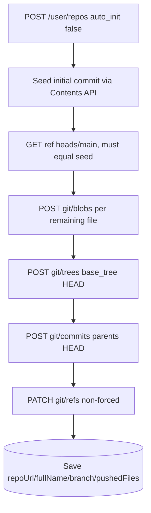

# 07 — GitHub Integration (connect + push, in detail)

How Drevo connects a user's GitHub account (OAuth) and pushes generated apps
to repositories. Covers setup, every endpoint, both push algorithms,
divergence safety, and the security model.

## 0. Mental model

```
Browser                          Drevo server                      GitHub
  |                                    |                              |
  |-- GET /api/github/connect -------->|                              |
  |<-- 302 github.com/authorize -------|                              |
  |-- (user approves on github.com) ------------------------------->|
  |<-- 302 /api/github/callback?code --|                              |
  |-- GET /callback ----------------->|                              |
  |                                    |-- token exchange ----------->|
  |                                    |-- GET /user ---------------->|
  |                                    |-- store encrypted token      |
  |<-- 302 /workspace?github=connected |                              |
  |                                    |                              |
  |-- POST /api/github/push ---------->|                              |
  |   {workspaceId + config}           |-- load workspace from DB     |
  |                                    |-- buildProjectFiles()        |
  |                                    |-- repos.create / git-db ---->|
  |<-- {repoUrl, fullName, branch} ----|                              |
```

Two hard rules shape everything below:

1. **The browser only ever sends `workspaceId` + push configuration.** The file
   map is rebuilt on the server from the DB via `buildProjectFiles()`
   (`lib/export-project.ts`). File content never travels client → server.
2. **The OAuth token never leaves the server.** It is stored AES-256-GCM
   encrypted and only decrypted inside route handlers to construct Octokit.

## 1. One-time setup (GitHub OAuth App)

Create an OAuth App at `github.com → profile → Settings → Developer
settings → OAuth Apps → New OAuth App`:

| Field | Value |
|---|---|
| Application name | `Drevo` (shown on the authorize screen) |
| Homepage URL | `http://localhost:3000` (production domain later) |
| Authorization callback URL | Must equal `GITHUB_REDIRECT_URI`, e.g. `http://localhost:3000/api/github/callback` |

Then fill `.env` (restart `npm run dev` afterwards):

```
GITHUB_CLIENT_ID=<shown on the app page>
GITHUB_CLIENT_SECRET=<generate once, shown once>
GITHUB_REDIRECT_URI=http://localhost:3000/api/github/callback
GITHUB_TOKEN_ENCRYPTION_KEY=<openssl rand -hex 32>
```

Checkbox guidance: leave **wildcard matching** and **Device Flow** off.
**Uncheck "Expire user access tokens"** — Drevo stores the access token
as-is and implements no refresh-token flow, so expiring tokens would break
pushes until reconnect.

## 2. Connect flow (OAuth)

### `GET /api/github/connect?workspaceId=` — `app/api/github/connect/route.ts`

```ts
GET(request: NextRequest) => 302 github.com/login/oauth/authorize | 401 | 500 JSON
```

1. `auth()` from Clerk; no `clerkId` → `401 {message: "Unauthorized"}`.
2. `newOAuthState()` — 24 random bytes hex (`lib/github.ts`).
3. `buildAuthorizeUrl(state)` — `https://github.com/login/oauth/authorize`
   with `client_id`, `redirect_uri`, `scope: "repo read:user"`, `state`.
   - `repo` scope allows creating repos and pushing code (incl. private).
   - `read:user` allows reading the username for display + ownership checks.
4. Sets two httpOnly, `SameSite=lax`, 10-minute cookies and redirects:
   - `github_oauth_state` = the state (CSRF protection).
   - `github_workspace_id` = `workspaceId` (where to return afterwards).
5. `500` if `GITHUB_CLIENT_ID` / `GITHUB_REDIRECT_URI` are unset (clear message).

### `GET /api/github/callback?code=&state=` — `app/api/github/callback/route.ts`

```ts
GET(request) => 302 /workspace?id=…&github=connected | 302 …&github=error | 401
```

1. Clerk `auth()` guard (401 if signed out mid-flow).
2. Reads `code`, `state`, expected state cookie, workspace cookie.
   Missing/mismatched state → `failRedirect()` (logs `[github/callback] …`,
   clears both cookies, redirects with `?github=error`).
3. `POST https://github.com/login/oauth/access_token`
   `{client_id, client_secret, code, redirect_uri}` →
   `{access_token}` (any `error`/`error_description` throws).
4. `octokit.rest.users.getAuthenticated()` → `{login, id}`.
5. `db.user.update({where: {clerkId}})` stores:
   `githubAccessToken: encryptToken(access_token)`,
   `githubUsername: login`, `githubUserId: String(id)`,
   `githubConnectedAt: new Date()`.
6. Clears cookies, redirects to `/workspace?id=…&github=connected`
   (or `/projects?github=connected` when no workspace cookie).
7. Any throw → `failRedirect()` with `?github=error`.

### Client pickup — `components/GithubPushDialog.tsx`

- `useState` initializer opens the dialog immediately when
  `?github=connected` is present (client-only read, SSR-safe).
- One mount effect strips the `github` param via `history.replaceState`,
  toasts success/error, and re-reads state via `GET /api/github/status`
  → `onConnectionChange(connected, username)` lifts it to `WorkspaceClient`.
- Connect button uses full-page `window.location.href` (not `router.push`)
  because the endpoint 302-redirects to `github.com` — client-side routing
  cannot follow that.

### `GET /api/github/status` and `DELETE /api/github/disconnect`

- `status/route.ts`: `GET () => {connected: boolean, username: string|null}`.
  Boolean only — the token is never selected for the client.
- `disconnect/route.ts`: `DELETE () => {ok: true}`. Nulls all four token
  columns. Already-pushed GitHub repos are untouched; only future pushes
  are revoked.

## 3. Shared export builder — `lib/export-project.ts`

Single source of truth so ZIP download and GitHub push cannot drift:

```ts
buildProjectFiles(input: {files, dependencies?, title?}): Record<path, content>
buildProjectFilesFromFileData(fileData: FileData, appTitle?): Record<path, content>
exportZipName(appTitle: string | null): string
BASE_DEPENDENCIES, GITIGNORE_CONTENT, ENV_EXAMPLE_CONTENT
```

Output map (repo-relative paths): `package.json` (CRA `react-scripts 5`,
`react ^18`, merged `BASE_DEPENDENCIES` + AI deps), `public/index.html`
(Tailwind CDN), `src/<path>` per generated file (`/App.js` → `src/App.js`),
`src/index.js` (StrictMode mount), `README.md`, `.gitignore` (`node_modules/`,
`.env*`, `.next/`, `dist/`, `build/`, `.DS_Store`), `.env.example`
(empty placeholders only — real secrets are never emitted).

`handleExportZip` (`CodePanel.tsx`) zips exactly this map; the push route
sends exactly this map. `BASE_DEPENDENCIES` is also reused for the Sandpack
`customSetup.dependencies`.

## 4. Push API — `POST /api/github/push`

`app/api/github/push/route.ts` (`runtime = nodejs`, `maxDuration = 120`).
Accepts `mode: "create" | "existing"` (defaults to `"create"`).

### 4.1 Shared preamble (both modes)

1. Clerk `auth()` → 401. JSON parse → 400. Zod schema → per-mode checks:
   create needs `repoName` (+`validateRepoName`) and `isPrivate`;
   existing needs `repoFullName` (+`parseRepoFullName`) and `branch`
   (+`validateBranchName`).
2. Load DB user (`id`, `githubAccessToken`, `githubUsername`);
   missing → 404; no token → `401 {code: GITHUB_NOT_CONNECTED}`;
   `decryptToken` failure → `401 {code: GITHUB_TOKEN_INVALID}`.
3. Load workspace by `{id: workspaceId, userId}` (ownership enforced);
   `parseFileData()` guard → 400 when empty.
4. `buildProjectFilesFromFileData()` → caps: 300 files, 8 MB total.

### 4.2 Create mode (slice 1)



- Step 1 records `createdRepo` so later failures can report
  `REPO_CREATED_PUSH_FAILED` + repo URL instead of going silent.
- Step 2 exists because the git-database blob endpoint answers
  `409 "Git Repository is empty."` on repos with zero commits — the
  Contents API implicitly creates blob + tree + commit + branch.
- Steps 3–5: ref moves **last** and **non-forced**; history is never
  partially updated. Default branch set to `main` best-effort.
- Name collision (422) → `409 "already exists… pick another name"`.

### 4.3 Existing mode (slice 2) — `pushToExisting()`

1. `parseRepoFullName()`; **owner must equal stored `githubUsername`**
   (case-insensitive) → else `403 "You can only push to your own
   repositories."` This enforces the "my repos only" picker scope even
   against tampered requests.
2. `repos.get` → 404 maps to `"Repository not found or no access."`
3. Branch resolve: `getRef heads/{branch}` → 404 → create from default
   branch HEAD; default HEAD missing (empty repo) → Contents-API seed on
   the target branch. Invalid name → 400 before anything is created.
4. Read HEAD commit + tree. Create blobs for current files, then the
   **identical-content early-out**: compare blob SHAs against the
   recursive HEAD tree with deletions applied — equal →
   `{unchanged: true}`, workspace timestamps refreshed, no commit.
   (Blob SHAs are content-addressed, so recreating identical blobs is
   harmless and no ref is touched.)
5. Tree = current files overlaid on `base_tree` + deletion entries
   (`sha: null`) for paths in stored `githubPushedFiles` absent now.
   Foreign files (never pushed by Drevo) survive via `base_tree`.
6. Commit `parents: [HEAD]` → `updateRef force: false`. A 422 here means
   HEAD moved underneath us → `409 {code: BRANCH_DIVERGED,
   "This branch changed on GitHub…"}`. No retry, no force, no overwrite.
7. Success saves `githubRepoUrl/fullName/branch/lastPushedAt` +
   `githubPushedFiles` (current paths) and returns
   `{repoUrl, fullName, branch}`.

### 4.4 Error-code contract (both modes)

| Code | HTTP | Meaning | Client action |
|---|---|---|---|
| `GITHUB_NOT_CONNECTED` | 401 | No stored token | Flip to disconnected, prompt Connect |
| `GITHUB_TOKEN_INVALID` | 401 | Rejected/decrypt-failed | Flip to disconnected, prompt reconnect |
| `REPO_CREATED_PUSH_FAILED` | 500 | Repo exists, upload incomplete | Amber box + repo link + retry-into-repo |
| `BRANCH_DIVERGED` | 409 | HEAD moved mid-push | Safe message, push again after review |

Push costs **no credits** — it is file transfer, not AI work.

## 5. Client — dialog, quick update, shared helper

### `lib/github-push-client.ts`

```ts
pushToGithub(payload): {ok, result{repoUrl, fullName, branch, unchanged?}}
                      | {ok:false, error{message, code?, repoUrl?, fullName?}}
listGithubRepos(search): GithubRepo[]   // GET /api/github/repos
listGithubBranches(fullName): string[]  // GET /api/github/branches
```

One code path for the dialog and the Update button — every server code is
handled identically in `applyResult()`.

### `GET /api/github/repos?search=` and `GET /api/github/branches?repo=`

- `repos/route.ts`: `listForAuthenticatedUser({affiliation: "owner",
  sort: "pushed", per_page: 100})`, up to 2 pages, substring `search`
  filter server-side → `{repos: [{fullName, name, private,
  defaultBranch, updatedAt, url}]}`.
- `branches/route.ts`: validates `owner/repo`, enforces owner == username,
  `listBranches` (100 cap) → `{branches: [{name}]}`; 404 → clean message.

### `GithubPushDialog.tsx` states and handlers

- `open` (auto-opens on `?github=connected`), `tab: new|existing`,
  `repoName/isPrivate/commitMessage`, `search/repos/selectedRepo`,
  `branches/selectedBranch`, `isPushing/isDisconnecting`,
  `justPushed/lastPush/failedRepo`.
- `handleOpenChange(next)` — prefills slugified `appTitle` on first open.
- `handleTabChange(next)` — switches forms, lazy-loads repos, swaps the
  commit-message default (`"Initial commit from Drevo"` /
  `"Update from Drevo"`).
- `handleSearchChange` — 400 ms debounced `loadRepos`.
- `handleSelectRepo` → `loadBranches` (auto-selects `main` if present,
  else first; empty repo defaults to `main`, which the push creates).
- `handlePush` / `handlePushExisting` — guard → `pushToGithub` →
  `applyResult` (toasts, `onPushed`, `failedRepo` box).
- `retryInCreatedRepo()` — jumps to the existing tab preselected with the
  failed repo (closes the slice-1 retry gap).
- `handleDisconnect` — `DELETE /api/github/disconnect` → disconnected state.
- `GithubMark` — inline GitHub SVG (the `lucide-react` brand export does
  not exist in the installed version). `DialogTrigger render=` follows the
  Base-UI pattern used across the codebase.

### One-click Update — `CodePanel.tsx` toolbar

Rendered when `lastPush` exists: `handleQuickUpdate()` posts
`mode: "existing"` with the stored `fullName/branch` and
`"Update from Drevo"`, spinner + toast feedback
(`"Already up to date on GitHub."` when `unchanged`). Disabled while
generating or with no `fileData`. Wiring:
`workspace/page.tsx → WorkspaceClient (githubConnected/username/lastPush
state) → CodePanel → SandpackInner`.

## 6. Security model

- Token encrypted (AES-256-GCM, SHA-256-normalized key) at rest; httpOnly
  OAuth `state` cookie validated; all Octokit calls server-side.
- Ownership checks on every read/write (`{id, userId}` / owner == username).
- `repoName` / branch validation; 300-file / 8 MB caps.
- Never force push; divergence fails safe; secrets never emitted.
- `POST /user/repos` deprecation warning (Octokit) targets March 2028 —
  no action needed.
