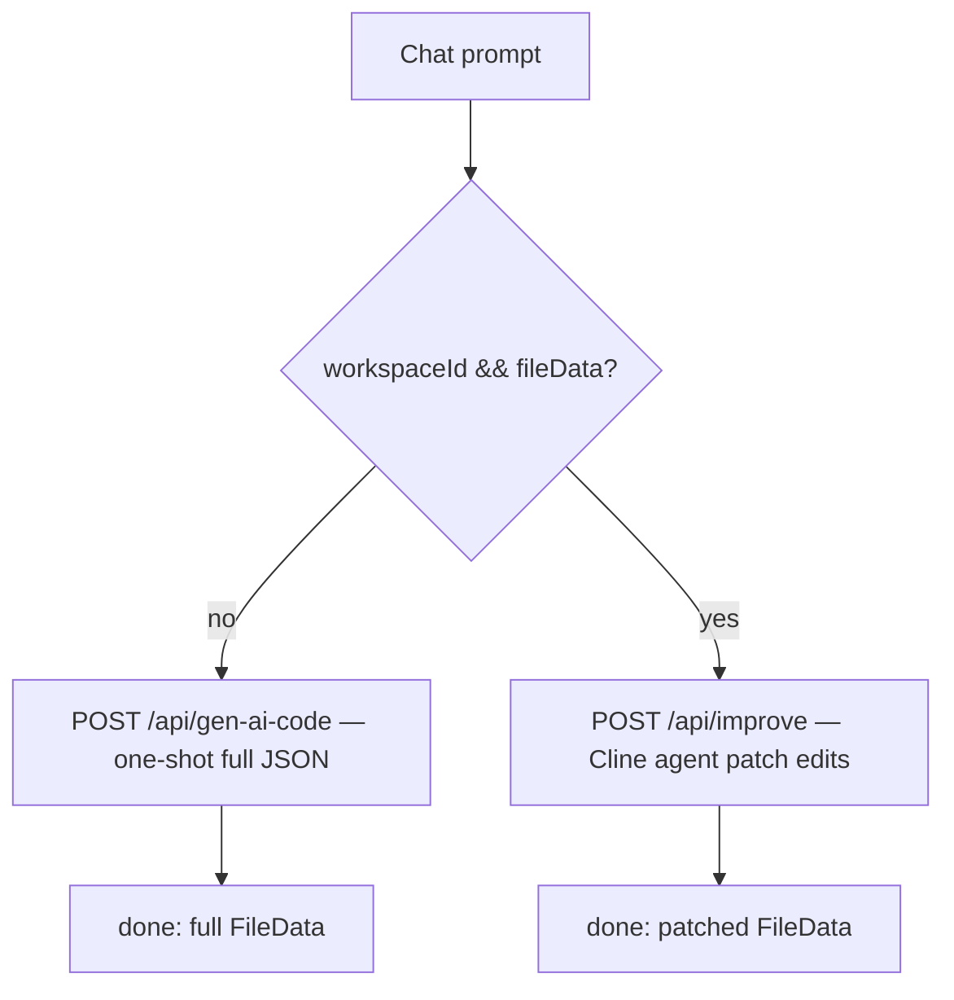

# 08 — AI Agent Deep Dive (generation, editing, tools, credits)

How Drevo turns prompts into apps and edits: the one-shot generator, the
Cline-based editing agent, every tool's lifecycle, the prompts that drive
them, the SSE contract, and exactly when credits move.

## 0. Two paths, one router



Routing lives in `WorkspaceClient`:
`onGenerate = workspaceId && fileData ? handleImprove : handleGenerate`
(`components/WorkspaceClient.tsx`). First prompt (nothing exists yet)
generates everything; every follow-up — chat edits, screenshot re-sends,
**Fix with AI** — patches through the agent. Regenerate and edit-resubmit
reuse the same two handlers with `{history, appendUser: false}` so no
duplicate user message is appended and rollback removes nothing extra.

Shared model facts: `gemini-3.5-flash` via `@google/genai` (generate) and
the Cline SDK (`providerId: "gemini"`, same model, `GEMINI_API_KEY`);
`runtime = nodejs`, `maxDuration = 300`; SSE via `ReadableStream` with the
safe pattern (`closed` flag, `safeEnqueue`/`safeClose`, `request.signal`
abort listener) so aborts never crash the stream.

## 1. Generation — `POST /api/gen-ai-code`

`app/api/gen-ai-code/route.ts`. Request:
`{workspaceId: string|null, userId, messages: Message[], fileData: FileData|null}`.

### 1.1 Guards (before any AI call)

401 no Clerk session → 400 no messages → 404 DB user missing →
402 `credits < CREDIT_COST_PER_GENERATION` (1). The Arcjet
per-user token-bucket + prompt-injection check exists (`lib/arcjet.ts`)
but its invocation is currently **commented out** in this route.

### 1.2 Helpers

```ts
trimHistory(messages): Message[]  // >10 → [first, ...last8]
sseEvent(type, payload): string   // "data: {...}\n\n"
extractThoughtLabel(text): string | null
// **Bold** heading preferred, else first sentence, 8–80 chars.
validateDependencies(deps): Record<string,string>
// fetch registry.npmjs.org/<pkg>/latest, 1.5 s timeout each;
// keeps res.ok only — hallucinated packages silently dropped.
buildContents(messages, fileData) // user→user/model roles; image hint
// prepended; last user msg gets "Current project files: <FileData JSON>".
isQuotaError / getQuotaRetryAfter / quotaErrorPayload
// detects quota/429/resource-exhausted; parses "retry in Xs";
// builds {message, code: QUOTA_EXCEEDED, retryAfter?}.
```

### 1.3 `SYSTEM_PROMPT` (exact-JSON contract)

Expert-React-developer persona with 10 rules; the load-bearing ones:
response must be one exact JSON object
`{assistantMessage, title, files: {"/App.js": {code}, …}, dependencies}`,
no markdown fences; functional components, no TypeScript in output;
Tailwind only; entry always `/App.js` with default export; imports only
from included files/packages; never list `react/react-dom/tailwindcss`
(always available); when modifying, include **all** files; images are
design references.

### 1.4 Stream processing

```ts
ai.models.generateContentStream({
  model: "gemini-3.5-flash", contents,
  config: { systemInstruction: SYSTEM_PROMPT, temperature: 0.7,
            responseMimeType: "application/json",
            thinkingConfig: { includeThoughts: true } },
})
```

- `part.thought` → `status{message: label}` throttled to one per 600 ms
  (status pill in the UI).
- anything else → appended to `accumulated` (the JSON document).
- Client abort / closed controller → stop silently.

### 1.5 Finish (inside one Prisma transaction)

1. `JSON.parse(accumulated)` → `error "AI returned invalid JSON"` (no charge).
2. Missing `files` object → `error` (no charge).
3. `status "Validating packages…"` → `validateDependencies` → `newFileData`.
4. `status "Saving…"` → `db.$transaction`:
   `workspace.update|create(messages + fileData)` +
   optional pre-run `workspaceVersion.create` (only when updating an
   existing workspace that already had files) +
   `user.update({credits: decrement 1})`.
5. `pruneVersions(workspaceId)` (cap 20), re-read credits,
   `done{workspaceId, assistantMessage, fileData, creditsRemaining}`.
6. Throw → quota maps to `error QUOTA_EXCEEDED`, else generic `error`.
   **No deduction on any failure path** — the decrement lives only in the
   success transaction. `finally safeClose()`.

## 2. Editing agent — `POST /api/improve`

`app/api/improve/route.ts`. Request:
`{userId, workspaceId, userRequest, imageUrl?, messages?, fileData}`.
Guards mirror generation (401/404/400/402, 1 credit, all plans).

### 2.1 Local accumulation model

```ts
patchedFiles: Record<path,{code}>        // seeded with current files
patchedDependencies: Record<pkg,ver>     // seeded with current deps
finalSummary = ""                        // set by done_improving
```

Tools mutate these locals; `file_patch` events stream live to the UI, but
**the client only applies patches to state at `done`** (avoids Sandpack
remounts mid-stream). Nothing is saved until `finishRun()`.

### 2.2 The three tools (`createTool`, all `autoApprove: true`)

**`update_file({path, code, reason})`** — `patchedFiles[path] = {code}`;
immediately `safeEnqueue(file_patch{path, code, reason})`; returns
`` `Updated ${path}: ${reason}` ``. Called once per changed file with the
**complete** file, never a diff.

```ts
updateFileTool = createTool({
  name: "update_file",
  description: "Update or rewrite a file in the React sandbox. …",
  inputSchema: z.object({ path: z.string().describe(…),
                          code: z.string().describe(…),
                          reason: z.string().describe(…) }),
  async execute({ path, code, reason }) { … },
})
```

**`add_dependency({package, version = "latest"})`** — accumulates into
`patchedDependencies`; validated against the npm registry in `finishRun`
before anything is saved. Allowed set is enumerated in the system prompt
(`lucide-react, recharts, react-router-dom, framer-motion, date-fns,
zod, react-hook-form`, …).

**`done_improving({summary})`** — sets `finalSummary`; declared with
`lifecycle: {completesRun: true}` so the Cline loop stops immediately
after it instead of burning more iterations.

### 2.3 Agent construction

```ts
agent = new Agent({
  providerId: "gemini", modelId: "gemini-3.5-flash", apiKey: GEMINI_API_KEY,
  maxIterations: 12,            // 2–4 files ≈ 1 turn each + thinking turns
  completionPolicy: { requireCompletionTool: true },  // plain-text endings
  systemPrompt,                                              // get nudged on
  tools: [updateFileTool, addDependencyTool, doneImprovingTool],
  toolPolicies: { update_file/autoApprove, … },
})
```

System prompt = persona + constraints (no TS/CSS-modules/npm-install) +
preferred-vs-available packages + **full current file dump**
(`// path\ncode` joined by `---`) + 4-step WORKFLOW (understand → touch
fewest files → batch all `update_file` calls in ONE turn with complete
contents → `done_improving` next turn, no commentary) + RULES (complete
files, keep functionality, `/App.js` entry, fix root causes of pasted
errors). Run input = optional image note + `Recent conversation` history
block (all but last message, via `buildConversationContext`, itself
`trimHistory`-bounded) + `User request:`.

### 2.4 Event subscription → SSE

```ts
agent.subscribe((event) => { … })
```

- `assistant-text-delta` → `thinking{text}` (streams into the placeholder
  assistant bubble in `ChatPanel`).
- `tool-started` → friendly deltas: `` Updating `path`… ``,
  `` Adding `pkg`… ``, `Finalizing changes…`.

### 2.5 `finishRun(summary, partial)` and the budget-exhaustion path

```ts
finishRun = async (summary, partial) => {
  validatedDeps = await validateDependencies(patchedDependencies);
  newFileData = { files: patchedFiles, dependencies: validatedDeps,
                  title: fileData.title };
  updatedMessages = [...buildMessagesWithImage(), {role: assistant, summary}];
  await db.$transaction([ workspace.update, workspaceVersion.create(pre-run),
                          user.update({credits: decrement 1}) ]);
  await pruneVersions(workspaceId);
  safeEnqueue(done{fileData, summary, partial, creditsRemaining});
}
```

- `result.status === "failed"` with a max-iterations-shaped message
  (`isMaxIterationsError` regex, `MaxIterationsError` class) →
  `getChangedPaths()` compares `patchedFiles` vs run-start files
  (+ dependency diff):
  - **Something changed** → `finishRun(partialNote, partial: true)` —
    keeps completed files (1 credit, like a normal run), summary names
    updated paths and says to ask to continue. Save failure inside this
    path → free `MAX_ITERATIONS` error.
  - **Nothing changed** → free friendly `MAX_ITERATIONS` error
    ("too large… one section at a time"), no deduction.
- Quota-shaped throws → `QUOTA_EXCEEDED` error, no deduction.
- Anything else → generic `error` with the message, no deduction.

`buildMessagesWithImage()` reuses the passed `messages` (or synthesizes
the single user message) and stamps `imageUrl` onto the trailing user
message so `/projects` and reloads keep the attachment.

## 3. Client orchestration — `WorkspaceClient.tsx`

- `parseMessages` / `parseFileData` guard DB JSON into state.
- `handleGenerate(prompt, imageUrl?, opts?)` — guards, appends user msg,
  `POST /api/gen-ai-code` with `fileData` from a ref (never stale),
  parses `status/done/error` SSE; `done` sets workspace/files/credits +
  assistant message + `history.replaceState(?id=)` + `refreshVersions()`;
  402 rolls back silently, 429 toasts; `AbortError` rolls back the appended
  message; other errors toast (5 s, 8–15 s for quota) + rollback.
- `handleImprove(userRequest, imageUrl?, opts?)` — guards (incl.
  workspace/files presence), appends user + empty assistant placeholder,
  `POST /api/improve`; `thinking` streams into the placeholder;
  `file_patch` events are rendered live by Sandpack while `fileData` state
  applies once at `done` (summary replaces thinking); 402/403 toasts +
  rollback of `rollbackCount` (2 normal, 1 for regenerate/edit).
- `handleRegenerate()` — drops trailing assistant message(s), re-runs the
  last user message with `appendUser: false` (costs 1 credit like a run).
- `handleEditMessage(index, content)` — truncates history at the edited
  user message and re-runs (same routing + credit behavior as fresh).
- `handleStop()` aborts whichever controller is live; `handleFixError()`
  routes preview errors to the agent when files exist, else generation.
- Version history: `refreshVersions()` after every run/restore,
  `handleRestoreVersion()` (server snapshots current first — undoable).
- **Realtime credits**: `decrementOptimistic()` (−1 + bus emit) on submit;
  authoritative `creditsRemaining` at `done` via `applyAuthoritative`;
  `refundOptimistic()` (+1 + emit) on 402/403/429, stream errors, aborts,
  quota/invalid-JSON. `HeaderCredits` listens on `lib/credits-bus.ts`
  (`emitCredits`/`subscribeCredits` CustomEvent).

## 4. SSE contract (both routes)

| Event | Payload | Notes |
|---|---|---|
| `status` | `{message}` | Thought labels, Validating, Saving, Agent working |
| `thinking` | `{text}` | Improve only; reasoning deltas |
| `file_patch` | `{path, code, reason}` | Improve only; live Sandpack patch |
| `done` | `{workspaceId?, fileData, creditsRemaining, assistantMessage?\|summary?, partial?}` | Only success deducts |
| `error` | `{message, code?, retryAfter?}` | `QUOTA_EXCEEDED` / `MAX_ITERATIONS` / generic; never deducts |

## 5. Credit rules (one place)

`CREDIT_COST_PER_GENERATION = 1`, `MIN_CREDITS_TO_GENERATE = 1`
(`lib/constants.ts`). Both AI routes 402-gate; decrement happens only
inside the success transaction; GitHub pushes, restores, regenerations of
nothing, aborts, quota and parse failures are all free. Regenerate and
edit-resubmit each cost 1 like a normal run.
