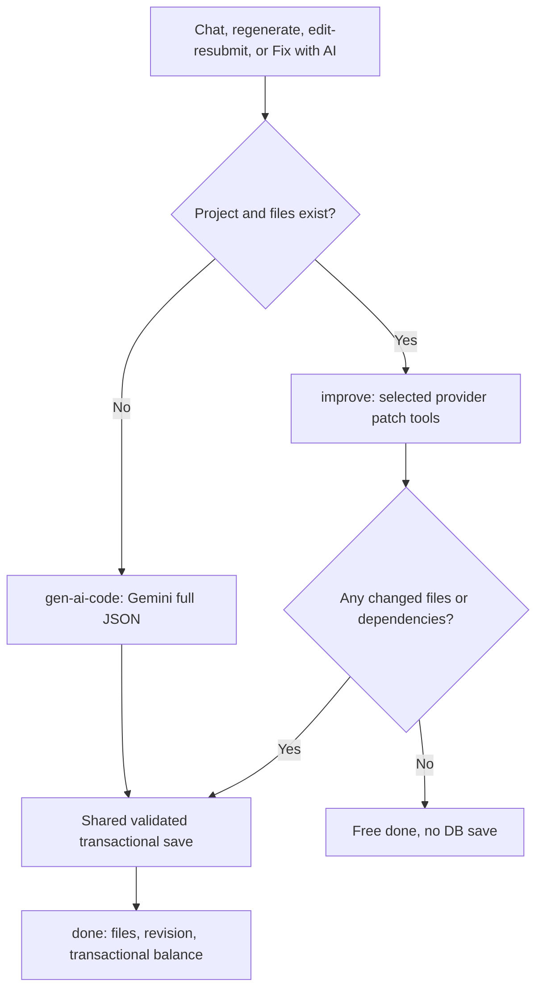

# 08 — AI Agent Deep Dive

Last reviewed: **2026-10-01**. This guide covers generation, editing, retries,
SSE, cancellation, and exactly where shared credits move. Root causes behind
the safeguards: [10](./10-audit-findings-and-fixes.md).

## 1. Two paths, one client router


```mermaid
flowchart TD
  Prompt[Chat, regenerate, edit-resubmit, or Fix with AI] --> Existing{Project and files exist?}
  Existing -- No --> Generate[gen-ai-code: Gemini full JSON]
  Existing -- Yes --> Improve[improve: selected provider patch tools]
  Generate --> Save[Shared validated transactional save]
  Improve --> Noop{Any changed files or dependencies?}
  Noop -- No --> Free[Free done, no DB save]
  Noop -- Yes --> Save
  Save --> Done[done: files, revision, transactional balance]
```

`WorkspaceClient` owns the router and state/refs. Initial prompts always use
Gemini; follow-ups, regenerate, edited-message resubmission, and preview fixes
use Gemini/Qwen/Atria as selected. There is no separate privileged Pro editing
path; all members/plans can edit when shared credits are available.

## 2. Providers and dependency pairing

| Path | Provider / model | Configuration |
|---|---|---|
| Initial generation | `@google/genai`, `gemini-3.5-flash` | `GEMINI_API_KEY` |
| Gemini edits | AI SDK Google provider, `gemini-3.5-flash` | `GEMINI_API_KEY` |
| Qwen edits | OpenRouter, `qwen/qwen3.8-27b:free` | `OPENROUTER_API_KEY` |
| Atria edits | OpenAI-compatible Chat Completions, `Atria-Dawn-Preview`, `https://api.atria-asi.ai/v1` | `ATRIA_API_KEY` |

`GEMINI_FALLBACK_MODEL` optionally provides a Gemini-only fallback after overload
exhaustion. It is not silently used instead of Qwen/Atria. Missing editing keys
return `*_NOT_CONFIGURED` before a provider call; arbitrary client model names
fail validation.

Current exact pairing: `ai 7.0.109`, `@ai-sdk/google 3.0.125`,
`@openrouter/ai-sdk-provider 3.1.0`, `@ai-sdk/openai-compatible 3.0.55`.
Do not float SDK/provider majors independently: the earlier model-spec mismatch
failed every edit before network work. Recheck assignability and build after
dependency updates; see [06](./06-troubleshooting.md).

## 3. Shared entry guards

Both routes:

1. Authenticate through Clerk; never trust a request `userId` as identity.
2. Read/validate a bounded body using `lib/ai-request.ts` schemas.
3. Apply shared Arcjet per-user token bucket/prompt screening (including no-ops).
4. Verify project-org membership, shared credits, and expected revision for an
   existing project. New creation requires OWNER/ADMIN and matching active org.
5. Acquire database leases for user and, when existing, workspace.
6. Use the combined request/disconnect/timeout cancellation signal.

Common pre-stream statuses: 400 invalid request/provider configuration; 401
signed out; 404 missing/inaccessible project; 402 no credits; 409 stale revision
or active lease; 429 screening/rate denial. No provider run or app charge on a
failed preflight.

The body reader checks 10,000,000 bytes, and file/dependency/history schemas
have explicit limits. An app guard does not replace upstream ingress limits,
nor does prompt screening establish a complete prompt-injection security proof.

### Database leases

`acquireAiLease` atomically claims `user:<id>` and optional `workspace:<id>` keys
with a random token and six-minute expiry. Only an expired row can be replaced.
Claiming multiple keys is transactional; conflict rolls back all claims.
Release deletes only the matching token, so an old run cannot delete a newer
claim. Leases work across serverless instances and are released best-effort;
expiry recovers crashed requests. Workspace **revision** checks are still needed
because a restore/stale tab can change state independently of provider work.

## 4. Generation — full JSON

`/api/gen-ai-code` accepts org ID, optional project ID/revision, messages, and
optional current files. History is trimmed for prompt construction: at most 10
messages as-is, otherwise first + last eight. The last user message includes
current project JSON for context.

The prompt requires one JSON object:

```ts
{
  assistantMessage: string;
  title?: string;
  files: Record<string, { code: string }>;
  dependencies: Record<string, string>;
}
```

It requests functional React, Tailwind styling, no generated TypeScript, an
`/App.js` default export, and all files needed for a complete project. Gemini
JSON MIME mode and optional thought parts produce statuses plus the accumulated
JSON text; thought labels are throttled.

### Retry envelope

Up to three overload attempts, abort-aware exponential backoff/jitter, fresh JSON
buffer each attempt. At-call and mid-stream failures are logged separately.
Optional Gemini fallback follows exhausted overload attempts. Quota errors are
reported with retry hints, not retried indefinitely. Provider config includes
the combined abort signal.

### Validation and save

`GeneratedOutputSchema` validates the parsed shape, then `validateApp` requires
nonempty `/App.js` with `export default`. Package names/version strings/file
paths and sizes are bounded. Dependency lookup checks npm package existence
with a 1.5-second timeout per request; it is **not** exact-version resolution,
security scanning, or compilation. Cancellation is rechecked after lookup.

Valid output enters `saveAiWorkspace`, described below. Empty `files: {}`,
invalid code types/paths, invalid JSON, missing entry point, and pre-commit
cancellation do not save or charge. Shape validation still cannot prove a
generated app compiles or works; Sandpack errors may require Fix with AI.

## 5. Editing — per-run patch tools

The improve request includes project/revision/request plus browser files and
optional history/image/model. The server seeds per-run maps from those files.
The revision prevents committing them over a newer saved project; the undo
snapshot comes from the database, not those browser maps.

### Tools

| Tool | Effect |
|---|---|
| `update_file({path, code, reason})` | Safe path, bounded full code; replace/add in local run map and emit `file_patch`. Not a database write. |
| `add_dependency({package, version = "latest"})` | Validate name/bounded version, accumulate; registry validation at finish. |
| `done_improving({summary})` | Set summary and stop tool loop. |

Tools with `execute` run automatically; there is no human approval loop.
Instructions encourage minimum changed files, batched full-file updates in one
turn, then completion. Files/history/package context inform the request.
No-op/question/refusal requests should complete without changing files.

### Loop and retries

`streamText` uses `toolChoice: "required"`,
`stopWhen: [stepCountIs(12), hasToolCall("done_improving")]`, combined abort
signal, and `maxRetries: 0`. `runAgentWithRetries` owns overload retry behavior:

- Fresh files/deps/summary before each attempt; no abandoned attempt patches
  leak into the saved result.
- Capture stream `error` parts as well as thrown errors. A captured 503 enters
  the same overload retry path rather than bypassing it.
- Declare captured state before `try`, so a call-time error does not become a
  temporal-dead-zone `ReferenceError`.
- Resolve steps/text for classification; abort returns null. Exhausted overload
  attempts carry their actual cause in `MaxIterationsError`.
- Quota is not blindly retried; nested errors/statuses and `Retry-After` feed
  the appropriate user message. An explicitly classified partial path can
  retain valid changes after some failed runs; see next section.

### Outcome classification

| Outcome | Persistence / app credits |
|---|---|
| Completion, no changed paths or deps | Free `done`; fresh org balance; no messages/version/files commit |
| Completion with valid changes | Shared atomic save; one credit |
| `MaxIterationsError` with valid retained changes (steps, captured quota, or exhausted overload) | May retain partial work with cause-honest summary; one credit if committed |
| Direct quota error, or classified failure with no retained work | Error, no save/charge |
| Cancellation before commit, invalid output, stale revision/access, failed save | No commit/charge |

Quota arriving as a captured error part is checked before successful completion
and converted to `MaxIterationsError("quota", ...)`. With retained valid changes,
that classified path can reach the partial-save branch; without changes it is a
free quota error. A directly thrown quota error takes the earlier free error
branch. See `route.ts` for exact ordering rather than assuming all quota/overload
failures or partial runs have the same outcome.

`createFinishRun` validates files before package fetches, checks cancellation
again afterward, builds messages/summary, and calls shared save. Attachment URL
is retained on the last user message where applicable.

## 6. Shared transactional save and history

`saveAiWorkspace` in `lib/workspace-save.ts`:

1. Validate final project shape and check abort.
2. Start transaction, lock org row, recheck current local membership/creation role.
3. Existing project: require owning org + expected revision, conditionally update
   files/messages and increment revision. New project: create org-owned record.
4. Record **database pre-edit file data** as a checkpoint/text delta for an
   existing project; immutable historical bases, hashes, at most four patches.
5. Guarded `Organization.updateMany` with `credits >= 1`, decrement one.
6. Read resulting balance inside transaction, check abort, commit.
7. Best-effort prune project history after commit; return
   `{workspaceId, revision, creditsRemaining}`.

All database effects roll back on a stale write, lost membership, no credits, or
abort observed during the transaction. Concurrent spend cannot be replaced by a
stale absolute billing balance update. Restore also uses an expected revision,
snapshots current DB files, and costs no credits.

`lib/versions.ts` is deliberately outside `"use server"`; pruning is internal
and exact-workspace scoped. It retains the newest 20 with deterministic pruning
order. Post-commit cleanup failure is logged but cannot turn a saved/charged run
into a reported failed generation. It can temporarily leave extra versions.
Retention now materializes boundary deltas before deleting required bases;
current workspace files remain full JSONB. See [11](./11-text-patch-version-history.md).

## 7. Cancellation and client reconciliation

- Node route budget: 300 seconds; signal timeout: 290 seconds.
- Signals combine request abort, stream disconnect, and timeout; SDK calls use it.
- Package validation/finalization and transaction checkpoints honor cancellation.
- UI Stop/unmount abort live controllers; duplicate local submits are guarded.
- `safeEnqueue`/`safeClose` tolerate closed streams and avoid double-close crashes.

Cancellation observed **before commit** is free. Cancellation/connection loss
**after commit** cannot unspend a completed transaction; SDK cancellation does
not guarantee a provider usage refund. An unconfirmed response triggers server
refresh. Do not claim a local optimistic refund proves no persisted charge.

Client refs carry latest messages/files/project/revision into async handlers.
Confirmed completion replaces files/messages, applies revision/balance, updates
URL/project refs, and refreshes versions. `file_patch` is progress, not a commit
receipt; in-flight output must not be treated as saved source for GitHub.

## 8. SSE contract and credit display

| Event | Payload / meaning |
|---|---|
| `status` | `{message}` — thought label, packages, saving, retry |
| `thinking` | `{text}` — edit progress |
| `file_patch` | `{path, code, reason}` — edit progress |
| `done` | `{fileData, creditsRemaining, revision, workspaceId?, assistantMessage?, summary?, partial?}` — completed saved work or free no-op |
| `error` | `{message, code?, retryAfter?}` — quota/overload/steps/validation/save failure |

Frame format: `data: <JSON>\n\n`, `text/event-stream`, no-cache. Once the stream
starts, failures are events, not a new HTTP error status.

The client optimistically subtracts one; `done` replaces that value with the
authoritative balance and failures refund display. `emitCredits(credits, orgId)`
updates only a matching header subscriber. Fresh server props/refresh resolve
unconfirmed completion. Other members' spends are not streamed by this local bus.

## 9. Image and safety boundaries

Supabase attachments are stored as URLs in messages. Both current prompt builders
include URL text rather than provider image parts. A URL hint does not prove the
model saw screenshot pixels; Atria is explicitly text-only. Multimodal input is
deferred. Storage organization-path names do not replace bucket authorization
policies; those policies require provider-side verification.

## 10. Tests

`npm test` includes actual-source mocked generation/retry/finalization tests and
in-memory PostgreSQL constraint/rollback/migration tests. It covers invalid/empty
output, revision conflicts, membership loss, insufficient credits, cancellation
during lookup/save, post-commit pruning, 503 retries, leases, and credit-event
scope. It makes no live provider generation, purchase, or repository push.
